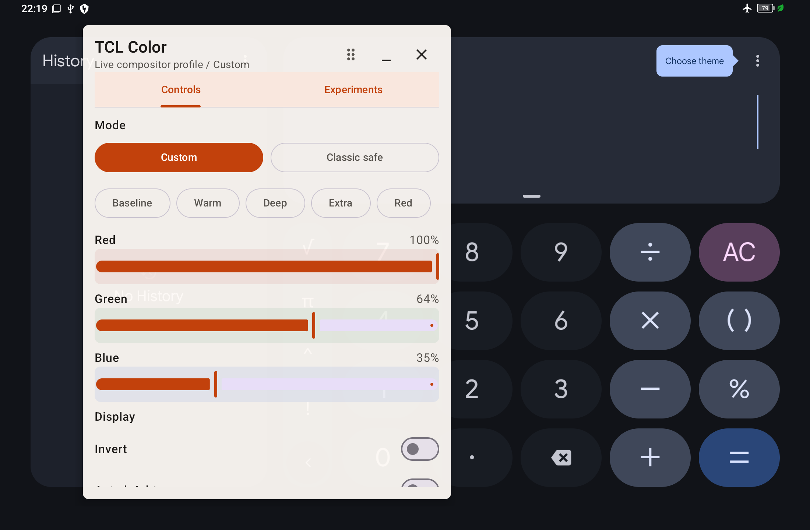
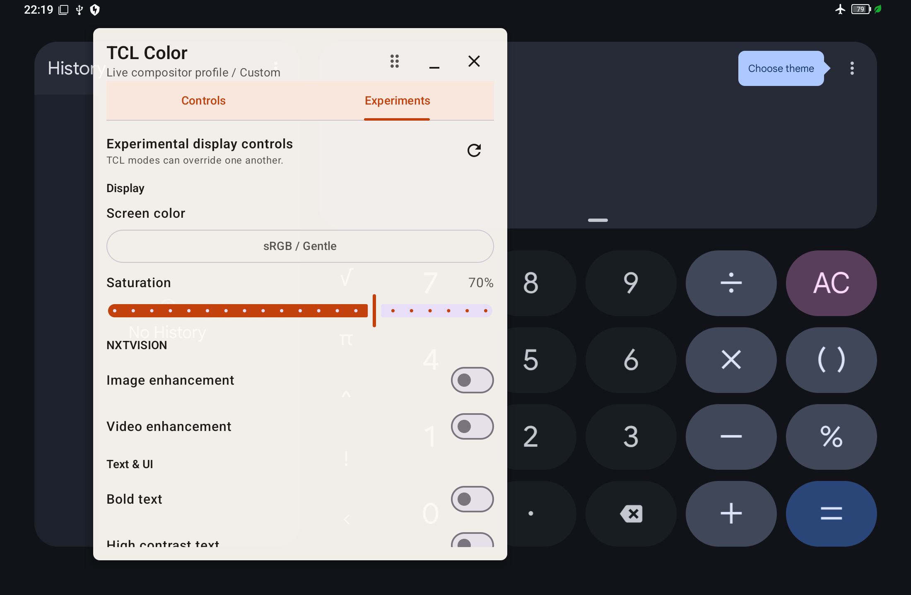

# TCL NXTPAPER Color Control

A compact floating Android control panel for deeper, no-root display adjustment
on the TCL NXTPAPER 11 Plus (9469X). It combines TCL's private NXTVISION Binder
service with Android display and accessibility settings to expose controls that
are otherwise scattered across the system UI.

> [!WARNING]
> This is an experimental, device-specific project. It is verified only on the
> exact tablet and firmware listed below. Take a settings snapshot before
> experimenting and expect behavior to differ after firmware updates.

| Controls | Experiments |
| --- | --- |
|  |  |

## Features

- Floating, movable panel opened from the launcher, a Quick Settings tile, or
  the app shortcut.
- Custom RGB channels plus Baseline, Warm, Deep, Extra, and Red presets.
- Full-screen Android color inversion with the TCL matrix reapplied afterward.
- Manual/automatic brightness and Extra Dim intensity controls.
- Saturation folded into the same 4x4 compositor matrix as the RGB profile.
- Six TCL Screen Color modes, including three Advanced variants.
- TCL Image Enhancement and Video Enhancement toggles.
- Android Bold Text and High Contrast Text toggles.
- A focused baseline restore action and external 20-key snapshot/restore scripts.

## Download APK

- [Download `v0.1.0` debug APK](https://github.com/jeffersondarcy/tcl-nxtpaper-color-control/releases/download/v0.1.0/tcl-nxtpaper-color-control-v0.1.0-debug.apk)
- [Download the SHA-256 checksum](https://github.com/jeffersondarcy/tcl-nxtpaper-color-control/releases/download/v0.1.0/tcl-nxtpaper-color-control-v0.1.0-debug.apk.sha256)
- [Read the release notes](https://github.com/jeffersondarcy/tcl-nxtpaper-color-control/releases/tag/v0.1.0)

Expected APK SHA-256:
`d5c3068eaeb2629f8d8c5a76bb00ac6b4d66cab52e631b2ba8c35e0f3ea0e38e`.

Before installing, enable USB debugging, authorize the computer, and confirm the
connected tablet is model `9469X` on build `1RFO`:

```bash
adb shell getprop ro.product.model
adb shell getprop ro.build.version.incremental
```

Then install the downloaded APK:

```bash
adb install -r tcl-nxtpaper-color-control-v0.1.0-debug.apk
adb shell pm grant com.jeff.tclcolorcontrol android.permission.WRITE_SECURE_SETTINGS
```

The APK is debug-signed and debuggable. It is intended for direct testing, not
as a hardened production build. A locally built APK may use a different debug
key; resolving `INSTALL_FAILED_UPDATE_INCOMPATIBLE` requires uninstalling the
existing app, which clears app preferences.

## Open The Panel

The most convenient entry point on the tested tablet is its configurable
NXTPAPER hardware key:

Launch **TCL Color Control** once and grant **Display over other apps**. This
registers the app shortcut and allows its floating panel to appear.

1. Open the NXTPAPER key configuration in TCL settings.
2. Assign long press to the app shortcut **Open TCL Color** (shown as
   **TCL Color** in compact lists).
3. Long-press the key from a reader or any other app to open the floating panel
   above the current screen.

Alternatively, accept the first-launch prompt or add the **TCL Color** Quick
Settings tile manually. Android may append it to the end of your active tiles,
so open Quick Settings edit mode and drag it closer to the beginning for easier
access.

## Compatibility

Tested on one device:

- TCL NXTPAPER 11 Plus, model `9469X`
- Product/codename: `9469X_EEA` / `Bellona_WF_GL`
- Android 15 / SDK 35
- Build `AP3A.240905.015.A2`, incremental `1RFO`
- Security patch `2026-04-05`

Other TCL models, regional variants, and firmware versions are unverified. The
app requires the private `tct_nxtvision` service and firmware-specific Binder
transactions, so installing successfully does not imply that controls will
work. See [device compatibility](docs/device-compatibility.md).

## Build From Source

Building requires JDK 17, Android SDK Platform 36, Android Platform Tools, USB
debugging, and an authorized connection to the tablet.

```bash
git clone https://github.com/jeffersondarcy/tcl-nxtpaper-color-control.git
cd tcl-nxtpaper-color-control
. scripts/android-env.sh
./gradlew :app:testDebugUnitTest :app:lintDebug :app:assembleDebug
scripts/android-install.sh
```

The install script builds a debug APK, installs it with `adb install -r`, tries
to grant `WRITE_SECURE_SETTINGS`, and reports whether readback confirmed the
grant. It refuses devices other than model `9469X` on build `1RFO` by default.
On first launch, Android also asks for **Display over other apps**. Use
**Grant brightness access** in the Controls tab to open **Modify system
settings** when needed.

## Permissions

| Permission/access | Purpose |
| --- | --- |
| Display over other apps | Keep the compact panel above a reader or other app. |
| Modify system settings | Change brightness and automatic brightness mode. |
| `WRITE_SECURE_SETTINGS` via ADB | Inversion, Extra Dim, Bold Text, High Contrast Text, and TCL matrix activation. |
| Foreground service | Keep the visible floating panel alive under Android 15. |

No root, bootloader unlock, or firmware modification is required.

## Before Experimenting

```bash
scripts/snapshot-color-state.sh diagnostics
# The script prints the created file path.
scripts/restore-color-state.sh diagnostics/color-state-TIMESTAMP.txt
```

The restore script accepts only a complete 20-key snapshot from the same serial,
model, and build fingerprint. Keep snapshots private because they contain device
identity and settings state; new snapshots are created with owner-only file
permissions.

## Important Limitations

- Bold Text and High Contrast Text affect Android-rendered UI. They usually do
  not change PDF pages that a reader has already rasterized into images.
- Image and Video Enhancement may apply only to apps or media pipelines selected
  by TCL firmware.
- OEM display modes can overwrite the compositor state; the app defensively
  reapplies its matrix around inversion changes but cannot control every OEM
  transition.
- **Restore baseline** in the app resets the TCL matrix, inversion, matrix
  activation, and Extra Dim. It is not a replacement for the comprehensive
  external 20-key snapshot restore.
- This project is not prepared for Google Play distribution and deliberately
  targets an older Android API for private vendor compatibility.

## Documentation

- [How it works](docs/how-it-works.md)
- [Device compatibility and observed behavior](docs/device-compatibility.md)
- [Development and verification](docs/development.md)

This project was built with AI-assisted development and validated through unit
tests, static analysis, shell checks, and real-device testing. It is licensed
under the [Apache License 2.0](LICENSE).
